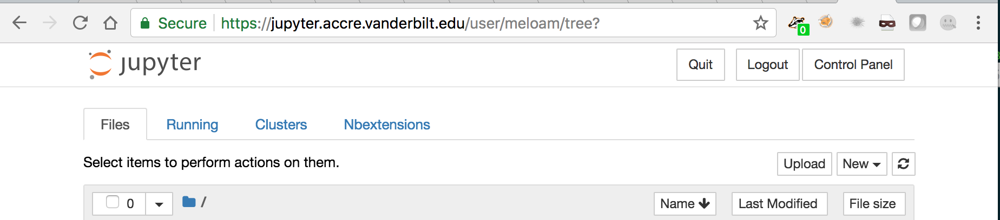

# NanoHRTHATS

## Setup on LPC
To run on LPC, log in via:
```bash
ssh -L localhost:9999:localhost:9999 username@cmslpc-sl6.fnal.gov
```
and setup CMSSW:
```bash
cmsrel CMSSW_10_2_15
cd CMSSW_10_2_15/src/ 
cmsenv
git cms-init --ssh
git cms-merge-topic cms-nanoAOD:master-102X --ssh
git checkout -b nanoAOD cms-nanoAOD/master-102X 

git clone https://github.com/cms-nanoAOD/nanoAOD-tools.git PhysicsTools/NanoAODTools
git clone https://github.com/hqucms/NanoHRT PhysicsTools/NanoHRT
git clone https://github.com/hqucms/NanoHRT-tools.git PhysicsTools/NanoHRTTools
git clone https://github.com/jmduarte/NanoHRTHATS PhysicsTools/NanoHRTHATS

scram b -j 8

voms-proxy-init -voms cms -valid 192:00
```

Then run the notebook
```bash
jupyter notebook --port 9999 --ip 127.0.0.1 --no-browser
```

## Setup on Vanderbilt
To run on Vanderbilt, login at https://jupyter.accre.vanderbilt.edu/ using your CERN credentials. Once you successfully connect, you should see the following front page



The two most important buttons are
  * The `new` button, which lets you open a terminal or start a new Jupyter notebook.
  * The `control panel` button, which lets you shut down your notebook once you're done. It's helpful to do this to free up resources for other users.

#### Upload Grid Certificates
We will copy your grid certificates from the LPC cluster, to do this, open the front page (shown above), and click the `New` box at the top right, then the `Terminal` option.

This will open a new tab with a bash terminal. Execute the following commands (following the appropriate prompts) to copy your certificate from the LPC to Jupyter (**note**: replace `username` with your `FNAL` username!)

The following command will prompt you for your FNAL password
```bash
kinit username@FNAL.GOV
rsync -rLv username@cmslpc-sl6.fnal.gov:.globus/ ~/.globus/
chmod 755 ~/.globus
chmod 600 ~/.globus/*
kdestroy
```

#### Initialize Your Proxy at every Login!
If you have a password on your grid certificate, you'll need to remember to execute the following in a terminal *each time you log in to Jupyter*. Similar to the LPC cluster, you will get a new host at each logon, and the new host won't have your old credentials.

Each time you log in, open a terminal and execute:
```bash
voms-proxy-init -voms cms -valid 192:00
```

#### Checkout the code
Open up a terminal and run the following command from your home area:
```bash
wget https://raw.githubusercontent.com/jmduarte/NanoHRTHATS/master/setup-libraries.ipynb
```


Go back to your Jupyter browser (Home) page and open/run(double-click) the newly downloaded notebook  ([setup-libraries.ipynb](setup-libraries.ipynb) - downloaded just recently - only one cell to run). This will checkout the code and setup your [setup-libraries.ipynb](setup-libraries.ipynb). After running [setup-libraries.ipynb](setup-libraries.ipynb), choose "File... Close and Halt". Then you can continue on to the Exercise section (below).


## Exercise
Run the notebook [taggerComp.py](taggerComp.py)

## Student project
Produce your own NanoAOD with all the taggers
```
cmsDriver.py test_nanoHRT_mc -s NANO -n 1000 --mc --eventcontent NANOAODSIM --datatier NANOAODSIM --no_exec --conditions 102X_mcRun2_asymptotic_v7 --era Run2_2016,run2_nanoAOD_94X2016 --customise PhysicsTools/NanoHRT/nanoHRT_cff.nanoHRT_customizeMC --filein /store/mc/RunIISummer16MiniAODv2/BulkGravTohhTohbbhbb_narrow_M-2500_13TeV-madgraph/MINIAODSIM/PUMoriond17_80X_mcRun2_asymptotic_2016_TrancheIV_v6-v1/80000/A88400F5-39B6-E611-BEB3-A0369F7F9DE0.root --fileout file:nano_mc.root --customise_commands "process.options = cms.untracked.PSet(wantSummary = cms.untracked.bool(True)); process.add_(cms.Service('InitRootHandlers', EnableIMT = cms.untracked.bool(False)))"
cmsRun test_nanoHRT_mc_NANO.py
```
